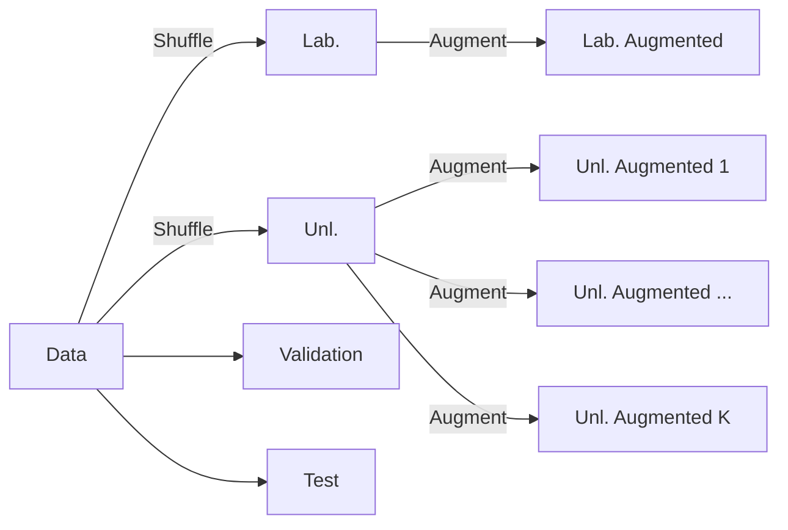
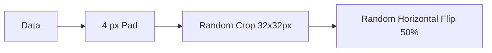
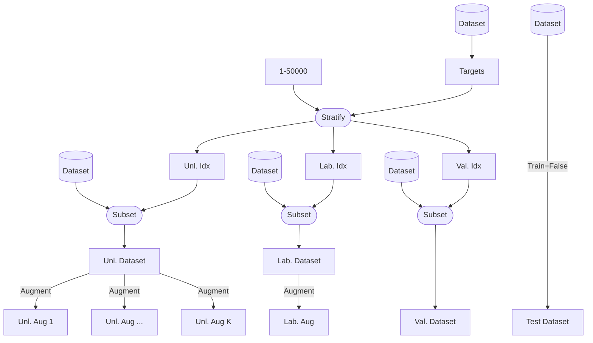

# Data Preparation

The data is split into 3 + K sets, where K is the number of augmentations.



As our labelled data is tiny, it's important to stratify the data
on the labels.

> The implementation used K = 2.

It's up to the user to decide how to augment, how much labelled data to use,
how much validation, etc.

## Data Augmentation

The data augmentation is simple



## Implementation

We found some difficulty working with `torchvision`'s CIFAR10 as the dataset
is on-demand. We implement this approach, however, it's not the only way to
do this.

In order to stratify and shuffle the data without loading the entire dataset,
we pass indices into the Dataset initialization, and pre-emptively shuffle and
filter out the indices.

```python
from typing import Sequence

import numpy as np
from torchvision.datasets import CIFAR10


class CIFAR10Subset(CIFAR10):
    def __init__(self, idxs: Sequence[int], **kwargs):
        super().__init__(**kwargs)
        self.data = self.data[idxs]
        self.targets = np.array(self.targets)[idxs].tolist()
```

Notably, `torchvision.datasets.CIFAR10` has
- 50,000 training images
- 10,000 test images

So, the process is to figure out how to split `range(50000)` indices into
the indices for the labelled and unlabelled data, furthermore, use the targets
to stratify the data.



> In total, 5 datasets are created, however, this shouldn't impact performance
> as they are all on-demand.
> Also note that only the test dataset has Train=False, the rest are all True.
{style='note'}

### Splitting Unlabelled to K Augmentations

Instead of trying to create K datasets, we create a single dataset, and
make it return K augmented versions of the same image.

```python
from typing import Sequence, Callable


class CIFAR10SubsetKAug(CIFAR10Subset):
    def __init__(self, k_augs: int, aug: Callable, idxs: Sequence[int], 
                 **kwargs):
        super().__init__(idxs=idxs, **kwargs)
        self.k_augs = k_augs
        self.aug = aug

    def __getitem__(self, item):
        img, target = super().__getitem__(item)
        return tuple(self.aug(img) for _ in range(self.k_augs)), target
```

This works by overriding the `__getitem__` method, and returning a tuple of
augmented images. Take note to update all downstream code to handle this.
