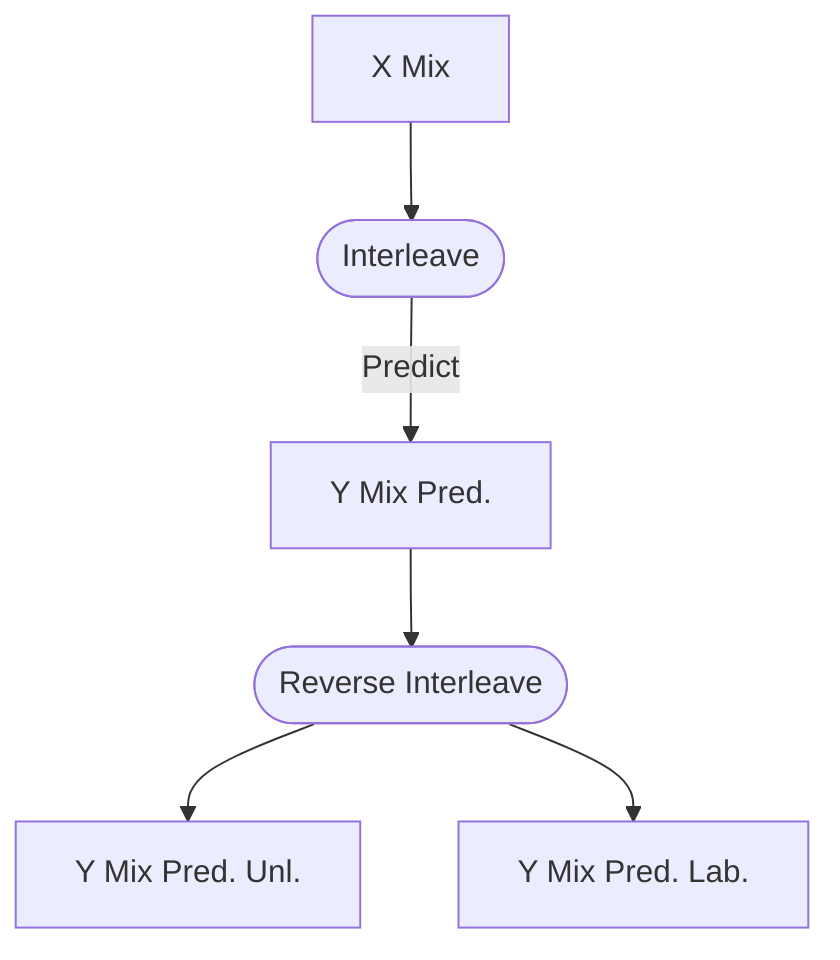

# Interleaving

The interleaving step in [MixMatch](https://arxiv.org/abs/1905.02249) is a
little bit of a mystery. The paper doesn't go into detail about it at all,
however, the TensorFlow implementation does use it. 

This issue thread [google-research/mixmatch/5](https://github.com/google-research/mixmatch/issues/5)
attempted to explain and justify the use of `Interleave`. However, it's unclear
if it's a limitation of TensorFlow or a necessary step for good performance.

## The Justification

Following the issue thread, `Interleave` creates a batch that is 
representative of the input data, as they
["only update batch norm for the first batch, ..."](https://github.com/google-research/mixmatch/issues/5#issuecomment-506432086)
Specifically, this batch should be of shape (B, C, H, W), where B is the
batch size. This differs from the input of shape (B, K + 1, C, H, W), where K 
is the number of augmentations.

> Again, we're not sure if this is a limitation or a recommended step by the
> paper as we are still able to forward pass the model with the input of shape
> (B, K, C, H, W).

`Interleave` **deterministically** mixes the labelled and unlabelled data to 
create a new batch of shape (B, C, H, W). 

## Interleaving Process {collapsible="true"}

This may sound a bit confusing, so let's review how we arrived at this step.

Recall that we only interleave the X Mix Up before prediction then reverse
the interleaving after prediction.



Remember the shapes of the data.

```tex
\begin{align}
\text{X Mix}&: [(B \cdot (K + 1)) \times C \times H \times W]\\
\text{Y Mix Pred.}&: [(B \cdot (K + 1)) \times Classes]\\
\text{Y Mix Pred. Unl.}&: [(B \cdot K) \times Classes]\\
\text{Y Mix Pred. Lab.}&: [B \times Classes]\\
\end{align}
```

Mix Up is just a proportional mix of the original data and a 
shuffled version of the data. Assuming a 32x32 RGB image, the shape of this X Mix:

```tex
B \times (K + 1) \times C \times H \times W =
3 \times (2 + 1) \times 3 \times 32 \times 32 
```

It's confusing with words, so let's visualize what interleave does.
Here, each cell is C x H x W with K = 2, B = 5

|                | B=0   | B=1 | B=2 | B=3 | B=4   |
|----------------|-------|-----|-----|-----|-------|
| K=0 Lab.       | CxHxW | ... |     |     |       |
| K=1 Unl. Aug 1 | ...   |     |     |     | ...   |
| K=2 Unl. Aug 2 |       |     |     | ... | CxHxW |

Given the constraint mentioned above, we can't use the first B x C x H x W for
prediction, as B x K=0 x C x H x W would just yield the first K, which are all
labelled data. This is not representative of X Mix.

1) Find all elements on the first augmentation

|            | Item 1 | Item 2 | Item 3 | Item 4 | Item 5 |
|------------|--------|--------|--------|--------|--------|
| Lab.       | O      | O      | O      | O      | O      |
| Unl. Aug 1 |        |        |        |        |        |
| Unl. Aug 2 |        |        |        |        |        |

2) Find all elements on the "diagonal", this is usually not a true diagonal as
   it's not perfectly square, we'll mark this as X.

|            | Item 1 | Item 2 | Item 3 | Item 4 | Item 5 |
|------------|--------|--------|--------|--------|--------|
| Lab.       | X      | X      |        |        |        |
| Unl. Aug 1 |        |        | X      | X      |        |
| Unl. Aug 2 |        |        |        |        | X      |

3) Swap these elements

|            | Item 1 | Item 2 | Item 3 | Item 4 | Item 5 |
|------------|--------|--------|--------|--------|--------|
| Lab.       | OX     | OX     | X      | X      | X      |
| Unl. Aug 1 |        |        | O      | O      |        |
| Unl. Aug 2 |        |        |        |        | O      |

> Note that because some elements are at the same position, they don't swap

Notice that this interleaving process proportionally mixes the labelled and
unlabelled data. This first row of shape (B, C, H, W) is then used to 
predict the labels of X Mix.

4) Reverse the interleaving process

|       | Item 1 | Item 2 | Item 3 | Item 4 | Item 5 |
|-------|--------|--------|--------|--------|--------|
| Aug 1 | OX     | OX     | O      | O      | O      |
| Aug 2 |        |        | X      | X      |        |
| Aug 3 |        |        |        |        | X      |

This process is perfectly reversible.

## Our Preliminary Results

We briefly tried this under 3 conditions:

1) With interleaving (the default implementation)
2) Without interleaving, across all augmentations
3) Batched across all augmentations

Our 2nd experiment is not subjected to the limitation mentioned above. We can
just pass the splits into the model sequentially.

Our 3rd experiment concatenates the splits into a single batch (in our case
we just didn't split it). This is the most representative of the data, as
the model is trained on the entire batch. Due to our larger batch, we also
multiplied the learning rate by (K + 1).


We can see that our 2nd experiment failed to converge, while our 1st and 3rd
are comparable. We tease out possible issues in the next section.
 
## BatchNorm is not order invariant

Let's dig a little deeper into BatchNorm, specifically, how the running mean
and variance are calculated.

```python
import torch
bn = torch.nn.BatchNorm1d(1, momentum=0.5)
bn(torch.ones(2, 1, 1))
print(bn.running_mean)  # 0.5
bn(torch.zeros(2, 1, 1))
print(bn.running_mean)  # 0.25
```

This outputs 0.5, 0.25 respectively, this is because

```tex
\begin{align}
\beta_0 &= 0\\
\beta_1 &= \beta_0 * (1 - m) + \beta_1 * m\\
        &= 0 * 0.5 + 1 * 0.5\\
        &= 0.5\\
\beta_2 &= \beta_1 * (1 - m) + \beta_2 * m\\
        &= 0.5 * 0.5 + 0 * 0.5\\ 
        &= 0.25\\
\end{align}
```

One can think of momentum as the weight of the new value, so a lower weight
means a slower change in the running mean and variance. This algorithm only 
depends on the **immediate previous value**, this means that this can be
a problem

```python
import torch
bn = torch.nn.BatchNorm1d(1, momentum=0.5)
bn(torch.ones(2, 1, 1))
bn(torch.ones(2, 1, 1))
bn(torch.zeros(2, 1, 1))
print(bn.running_mean)  # 0.3750

bn = torch.nn.BatchNorm1d(1, momentum=0.5)
bn(torch.zeros(2, 1, 1))
bn(torch.ones(2, 1, 1))
bn(torch.ones(2, 1, 1))
print(bn.running_mean)  # 0.7500
```

Despite the same input, the running mean is different. This is reflective of
our previous experiment, where we split the data into multiple batches to pass
into the model sequentially, it's heavily biased **against** the first batch,
which is our labelled data.

To fix this, instead of passing them in sequentially, we can pass them in
a single batch. This is what we did in our 3rd experiment, and it has the same
effect with the 1st experiment, where we interleaved the data.

To recap, these are how our 3 experiments passed the `x_mix` into the model.

```python
import torch
bn = torch.nn.BatchNorm1d(...)

def interleave(x) -> torch.Tensor: ...

N_AUGS = 4
x_mix = torch.ones(2, N_AUGS, 1, 1)

# Experiment 1
x_mix = interleave(x_mix)
bn(x_mix[:, 0, ...])

# Experiment 2
for i in range(N_AUGS):
    bn(x_mix[:, i, ...])
    
# Experiment 3
bn(x_mix.reshape(-1, 1, 1))
```

## Conclusion

It's inconclusive if interleaving is necessary, as passing the whole batch
into the model has the same effect, and theoretically, more sound. However,
it's clear that passing the data sequentially is not a good idea.