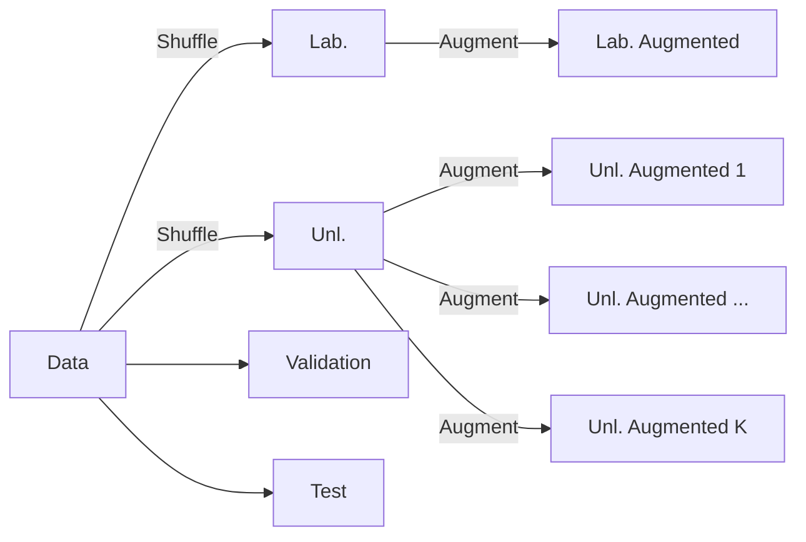
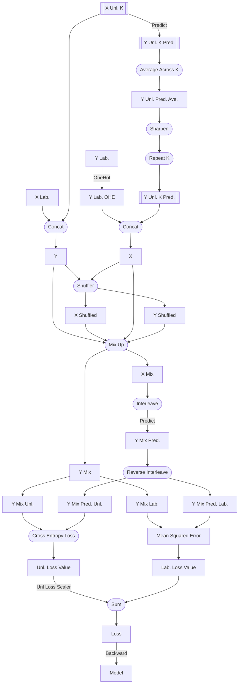

# Pipeline

There are several crucial details about the pipeline of MixMatch that aren't 
mentioned in the paper that makes or breaks the performance of the model. This
document aims to explain the pipeline in detail.

## Shortforms

- X: input data, in this case, images
- Y: labels of the input data
- K: number of augmentations, or to refer to the kth augmentation
- Lab.: labeled data
- Unl.: unlabeled data

## Data Preparation

The data is split into 3 + K sets, where K is the number of augmentations.



See [Data Preperation](Data-Preparation.md) for more details.

## Model Architecture

We used a Wide ResNet 28-2 as the base model. This is a custom implementation
based on [YU1ut's PyTorch Implementation](https://github.com/YU1ut/MixMatch-pytorch/tree/master)
and [Google Research's TensorFlow Implementation](https://github.com/google-research/mixmatch)


## Training

Training is rather complex. The key steps are illustrated below.

To highlight certain steps, we use the following notation:


This is the pipeline of the training process.



We have both **Data** and **Data List**, as the augmentations create a new
axis in the data.

A few things to note:
- `Concat` is on the Batch axis, the 1st axis.
- `Predict` uses the model's forward pass.
  - The Label Guessing Prediction, `Predict(X Unl. K)`, doesn't use gradient.
- The Mix Up Shuffling is on the Batch axis, which includes the augmentations.
  If the data is of shape (B, K, C, H, W), the shuffling happens on both B and 
  K.
- CIFAR10 (and most datasets) are not even, use `drop_last` on the
  DataLoader to avoid errors.
### Sharpening

This is a step to make the Unlabelled Predictions more confident. This is done
by raising the predictions to a power, then normalizing the predictions.

```tex
\begin{align}
\text{Sharpen}(Y) &= \frac{Y^{\frac{1}{\tau}}}{\sum_{i=1}^{C} Y_i^{\frac{1}{\tau}}}
\end{align}
```

A higher `tau` value will make the predictions more confident.

### Mix Up

Mix Up mixes the original data with a shuffled version of the data. This ratio
of this mix is determined by a random **modified** sample from a Beta 
distribution. The modified sample is the maximum of the sample and its
complement.

```tex
\begin{align}
\text{Mix Up}(X, X_{\text{Shuffled}}) 
&= \hat\lambda X + (1 - \hat\lambda) X_{\text{Shuffled}}\\
\hat\lambda &= \max(\lambda, 1 - \lambda)\\
\lambda &\sim \text{Beta}(\alpha, \alpha)\\
\end{align}
```

Notably, when we modify the sample, we're effectively always taking the 
**larger** value, making the original sample **more prevalent** during the mix.

### Unlabelled Loss Scaler

> The original paper refers to this as the `lambda_u` hyperparameter.

The unlabelled loss scaler is a scalar that scales the unlabelled loss. This
linearly increases from 0 to 100 over the course of training.

The implementation is simple, just take the current epoch and divide by the
total number of epochs.

### Interleaving

Interleaving is not a well-documented step in the paper. See our 
[Interleaving](Interleaving.md) document for more details.

## Evaluation

The evaluation is simple. We just take the accuracy of the model on the test
set.