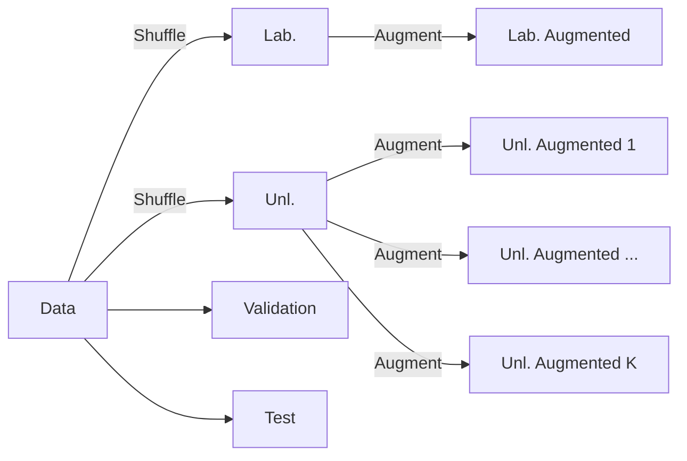
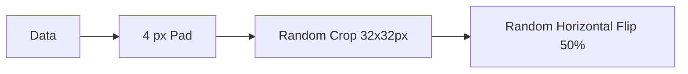
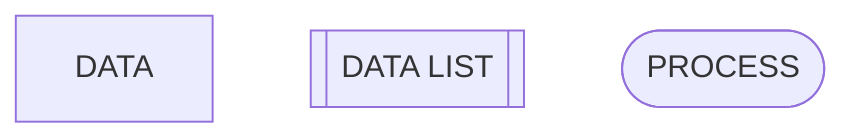
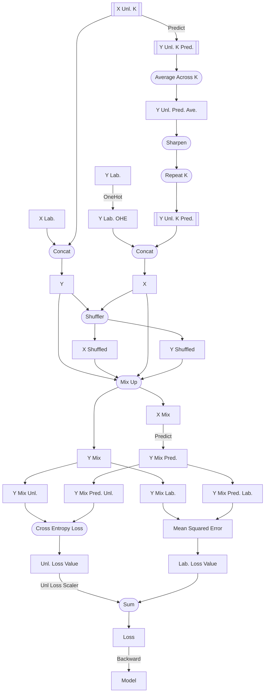

# Pipeline

There are several crucial details about the pipeline of MixMatch that aren't 
mentioned in the paper that makes or breaks the performance of the model. This
document aims to explain the pipeline in detail.

We document the pipeline in a few stages
- Data Preparation
- Data Augmentation
- Model Architecture
- Training
- Evaluation

## Shortforms

- X: input data, in this case, images
- Y: labels of the input data
- K: number of augmentations, or to refer to the kth augmentation
- Lab.: labeled data
- Unl.: unlabeled data

## Data Preparation

The data is split into 3 + K sets, where K is the number of augmentations.

## Data Augmentation

The data augmentation is simple

## Model Architecture

We used a Wide ResNet 28-2 as the base model. 

## Training

Training is rather complex. The key steps are illustrated below.

To highlight certain steps, we use the following notation:

This is the pipeline of the training process.

There are a few things to note:
- Concatenation happens on the Batch axis, which is the first axis.
- Predict uses the model's forward pass.
  - **The first predict requires no gradient.**
- The Mix Up Shuffling happens on the Batch axis, which also includes the
  augmentations. So if your data is of shape (B, K, C, H, W), the shuffling
  happens on both B and K. (Use reshape before shuffling)
- CIFAR10 (and most datasets) are not even, use `drop_last` on the
  DataLoader to avoid errors.

### Details

- **Unl. Loss Scaler** is simply multiplies the unlabeled loss. In 
  the original paper, it's recommended to linearly increase the scaler from 0
  to 100.
- 

