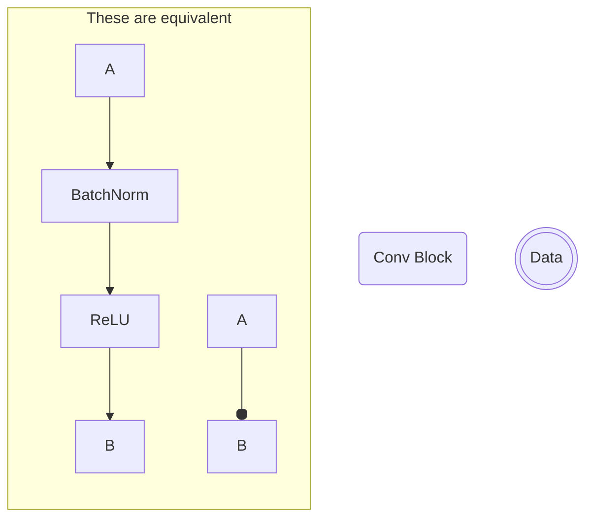

# WideResNet 28-2

To keep it short, we use the following shorthands.

1) A Conv layer is annotated with a rounded rectangle with:
    - shape of the kernel `_x_`
    - number of channels `_C`
    - stride `_S`
    - padding `_P`
2) BN and ReLU are annotated with a circle at the end of a line `---o`
3) A node that is doubly circled is a data block, it's not an operation,
   it's just to indicate the current data's channel count.
4) A (+) indicates an element-wise addition.
5) Other operations are annotated with a rectangular box.



## Model Diagram

```mermaid
graph TD
    X[Input] --> X0(3x3 16C 1S 1P) --> G0IN
     
    subgraph SGR0IN[Group 0 Projection]
        G0IN(((16C)))
        --o G0IN1(3x3 32C 1S 1P) 
        --o G0IN2(3x3 32C 1S 1P) 
        --> G0INADD([+])
        G0IN --o G0INProj(1x1 32C 1S 0P) --> G0INADD
    end
    
    G0INADD --> G0
    
    subgraph SGR0["Group 0 x (N - 1)"]
        G0(((32C)))
        --o G01(3x3 32C 1S 1P)
        --o G02(3x3 32C 1S 1P)
        --> G0ADD([+])
        G0 --o G0ADD
    end
    
    G0ADD --> G1IN
        
    subgraph SGR1IN[Group 1 Projection]
        G1IN(((32C)))
        --o G1IN1(3x3 64C 2S 1P) 
        --o G1IN2(3x3 64C 1S 1P) 
        --> G1INADD([+])
        G1IN --o G1INProj(1x1 64C 2S 0P) --> G1INADD
    end
    
    G1INADD --> G1
    
    subgraph SGR1["Group 1 x (N - 1)"]
        G1(((64C)))
        --o G11(3x3 64C 1S 1P)
        --o G12(3x3 64C 1S 1P)
        --> G1ADD([+])
        G1 --o G1ADD
    end
    
    G1ADD --> G2IN
        
    subgraph SGR2IN[Group 2 Projection]
        G2IN(((64C)))
        --o G2IN1(3x3 128C 2S 1P) 
        --o G2IN2(3x3 128C 1S 1P) 
        --> G2INADD([+])
        G2IN --o G2INProj(1x1 128C 2S 0P) --> G2INADD
    end
    
    G2INADD --> G2
    
    subgraph SGR2["Group 2 x (N - 1)"]
        G2(((128C)))
        --o G21(3x3 128C 1S 1P)
        --o G22(3x3 128C 1S 1P)
        --> G2ADD([+])
        G2 --o G2ADD
    end
        
    G2ADD
    --o AP[AvgPool 8x8 1S 0P] 
    --> L[Linear 10C]
    --> O[Output]
```



## Block Repeats

Blocks above annotated with `x (N - 1)` are repeated N - 1 times. 
N - 1 is because the first block is already counted in the Group Projection.

## Projection Layers

Projection Layers are Convolutional Layers with a kernel size of 1x1. They are
mainly used to manipulate the number of channels.

In the above diagram, projection layers are used in the Group X projection blocks.
They are necessary as a skip connection will not work if the number of channels
added are different.

## Strides

In some convolutional layers, strides of 2 are used to reduce the size of the
output. This is done on Group 1 and 2


## Model Diagram Pseudocode WideResNet 28-2


```
Conv torch.Size([16, 3, 3, 3]) Stride 1 Pad 1
Group 0
	Block 0
		BN -> ReLU = X
		Conv torch.Size([32, 16, 3, 3]) Stride 1 Pad 1
		BN -> ReLU
		Conv torch.Size([32, 32, 3, 3]) Stride 1 Pad 1 = Z
			X -> Conv torch.Size([32, 16, 1, 1]) Stride 1 Pad 0
			Z + X
	Block 1
		BN -> ReLU = X
		Conv torch.Size([32, 32, 3, 3]) Stride 1 Pad 1
		BN -> ReLU
		Conv torch.Size([32, 32, 3, 3]) Stride 1 Pad 1 = Z
			Z + X
	Block 2
		BN -> ReLU = X
		Conv torch.Size([32, 32, 3, 3]) Stride 1 Pad 1
		BN -> ReLU
		Conv torch.Size([32, 32, 3, 3]) Stride 1 Pad 1 = Z
			Z + X
	Block 3
		BN -> ReLU = X
		Conv torch.Size([32, 32, 3, 3]) Stride 1 Pad 1
		BN -> ReLU
		Conv torch.Size([32, 32, 3, 3]) Stride 1 Pad 1 = Z
			Z + X
Group 1
	Block 0
		BN -> ReLU = X
		Conv torch.Size([64, 32, 3, 3]) Stride 2 Pad 1
		BN -> ReLU
		Conv torch.Size([64, 64, 3, 3]) Stride 1 Pad 1 = Z
			X -> Conv torch.Size([64, 32, 1, 1]) Stride 2 Pad 0
			Z + X
	Block 1
		BN -> ReLU = X
		Conv torch.Size([64, 64, 3, 3]) Stride 1 Pad 1
		BN -> ReLU
		Conv torch.Size([64, 64, 3, 3]) Stride 1 Pad 1 = Z
			Z + X
	Block 2
		BN -> ReLU = X
		Conv torch.Size([64, 64, 3, 3]) Stride 1 Pad 1
		BN -> ReLU
		Conv torch.Size([64, 64, 3, 3]) Stride 1 Pad 1 = Z
			Z + X
	Block 3
		BN -> ReLU = X
		Conv torch.Size([64, 64, 3, 3]) Stride 1 Pad 1
		BN -> ReLU
		Conv torch.Size([64, 64, 3, 3]) Stride 1 Pad 1 = Z
			Z + X
Group 2
	Block 0
		BN -> ReLU = X
		Conv torch.Size([128, 64, 3, 3]) Stride 2 Pad 1
		BN -> ReLU
		Conv torch.Size([128, 128, 3, 3]) Stride 1 Pad 1 = Z
			X -> Conv torch.Size([128, 64, 1, 1]) Stride 2 Pad 0
			Z + X
	Block 1
		BN -> ReLU = X
		Conv torch.Size([128, 128, 3, 3]) Stride 1 Pad 1
		BN -> ReLU
		Conv torch.Size([128, 128, 3, 3]) Stride 1 Pad 1 = Z
			Z + X
	Block 2
		BN -> ReLU = X
		Conv torch.Size([128, 128, 3, 3]) Stride 1 Pad 1
		BN -> ReLU
		Conv torch.Size([128, 128, 3, 3]) Stride 1 Pad 1 = Z
			Z + X
	Block 3
		BN -> ReLU = X
		Conv torch.Size([128, 128, 3, 3]) Stride 1 Pad 1
		BN -> ReLU
		Conv torch.Size([128, 128, 3, 3]) Stride 1 Pad 1 = Z
			Z + X
BN -> ReLU
AvgPool 8 Stride 1 Pad 0
View
Linear torch.Size([10, 128])
```
{collapsible="true" collapsed-title="Model Diagram Pseudocode"}